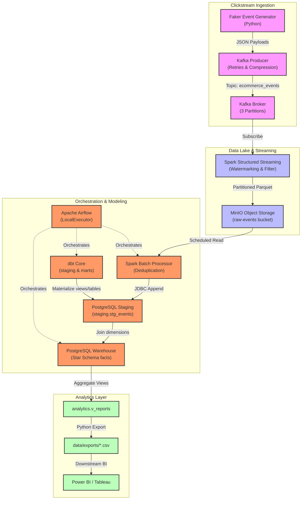
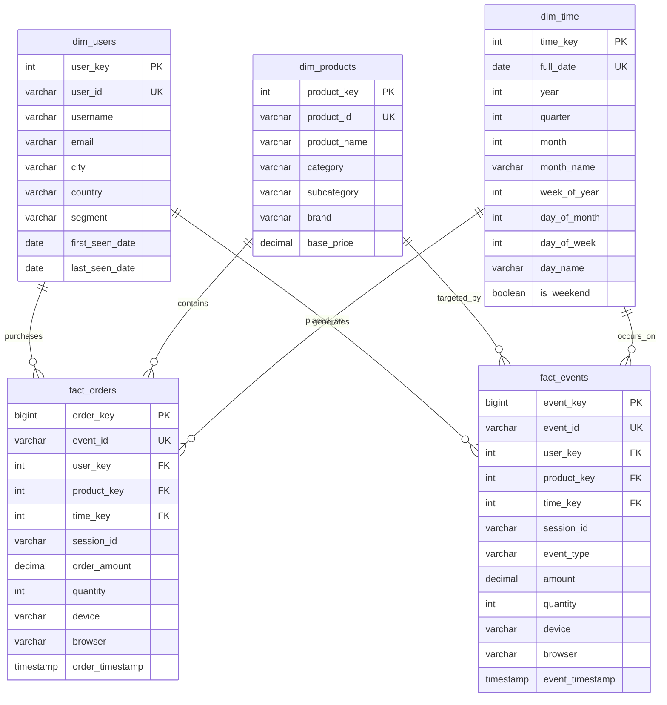

# System Architecture & Design Deep-Dive

This document provides a detailed breakdown of the architectural design, network topology, storage tiers, and data schemas deployed inside our E-Commerce Data Engineering Platform.

---

## 📊 End-to-End System Architecture

---

## 🛣️ Data Flow Lanes

### ⚡ The Real-Time Streaming Lane
1. **Source Generation:** A stateful Python Faker script runs. It maintains user cookie states, generating multi-step session sequences (e.g. searching products, adding to cart, completing checkouts).
2. **Buffer Ingestion:** The `EcommerceKafkaProducer` writes JSON arrays of click events into our Kafka topic `ecommerce_events`. It is configured with `acks=all` (ensuring at least one broker commits the event), `linger_ms=10` (buffering for network throughput), and `compression_type=gzip` (reducing bandwidth).
3. **Stream Parsing:** `streaming_consumer.py` subscribes to Kafka using PySpark. It maps the raw string column into a strict StructType schema, filters blank or negative values, adds a **10-minute watermark** to manage late-arriving packets, and appends the records to S3 raw-events.
4. **Lake Partitioning:** Spark writes Parquet files divided into sub-directories like `event_date=YYYY-MM-DD/`, isolating daily records and optimizing downstream column scans.

### ⚙️ The Scheduled Batch Lane
1. **Airflow Orchestration:** Every hour, Apache Airflow executes the `ecommerce_analytics_pipeline` DAG. 
2. **Batch Deduplication:** Airflow runs the Spark Batch Processor, which loads the latest date partition from MinIO, filters any duplicates via `dropDuplicates(['event_id'])`, and loads the records into PostgreSQL `staging.stg_events`.
3. **dbt Modeling:** Airflow triggers dbt to parse staged click records. dbt compiles models that separate raw attributes into staging views (`stg_events`, `stg_users`, `stg_products`) and computes lifetime totals to build dimension tables (`dim_users`, `dim_products`).
4. **Surrogate Key Loading:** Airflow runs `load_facts.py` which executes PostgreSQL insert transactions. It resolves late-arriving dimensions and joins staging fields against `dim_users`, `dim_products`, and `dim_time` to load surrogate keys into `fact_events` and `fact_orders`.
5. **Dashboard Updates:** Finally, Airflow executes views updates and CSV exports to prepare data reports for BI dashboards.

---

## 🗄️ Relational Database Schema Model (Star Schema)

Our data warehouse uses a Kimball Star Schema model optimized for Analytical queries (OLAP):

---

## 🔒 Security & Network Isolation

All platform containers reside on a shared bridge network: `ecommerce-network`. 
* **Port Protection:** Inside this network, services resolve to internal container hostnames (e.g. `postgres:5432`, `kafka:29092`, `spark-master:7077`). Only necessary operational endpoints are mapped externally to localhost (e.g. Postgres port `5432`, Kafka port `9092`, Airflow port `8081`), ensuring full database isolation.
* **Volume Persistence:** Container states are mapped onto named docker volumes (`postgres_data`, `minio_data`, etc.), meaning database assets persist even when containers are restarted.
