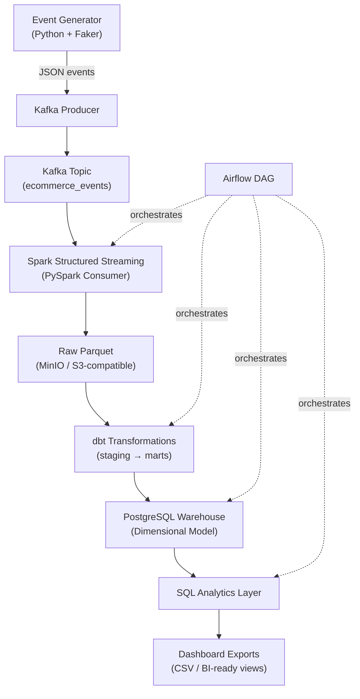

# Real-Time E-Commerce Analytics Data Engineering Platform

## Implementation Plan

Build a complete, production-style hybrid Batch + Streaming Data Engineering platform that simulates real-world e-commerce activity. The system ingests, processes, transforms, stores, orchestrates, models, and analyzes data using modern DE tools — all locally runnable via Docker Compose.

---

## Architecture Overview



---

## Proposed Folder Structure

```
Real-Time E-Commerce Analytics Data Engineerin/
├── docker-compose.yml
├── .env
├── .gitignore
├── README.md
├── requirements.txt
├── Makefile
│
├── src/
│   ├── __init__.py
│   ├── event_generator/
│   │   ├── __init__.py
│   │   ├── generator.py          # Faker-based event generator
│   │   ├── kafka_producer.py     # Kafka producer with retry/logging
│   │   └── config.py             # Configuration constants
│   │
│   ├── kafka/
│   │   ├── __init__.py
│   │   └── consumer.py           # Standalone Kafka consumer (utility)
│   │
│   ├── spark/
│   │   ├── __init__.py
│   │   ├── streaming_consumer.py # Spark Structured Streaming job
│   │   ├── batch_processor.py    # Batch processing job
│   │   └── transformations.py    # Spark SQL transformations
│   │
│   ├── warehouse/
│   │   ├── __init__.py
│   │   ├── models.py             # SQLAlchemy ORM models
│   │   ├── schema.sql            # DDL for dimensional model
│   │   ├── seed_dimensions.py    # Seed dim tables
│   │   └── load_facts.py         # Load fact tables from Parquet
│   │
│   ├── analytics/
│   │   ├── __init__.py
│   │   ├── queries.sql           # Analytical SQL queries
│   │   ├── export_csv.py         # CSV export script
│   │   └── create_views.sql      # Reporting views
│   │
│   ├── quality/
│   │   ├── __init__.py
│   │   ├── validators.py         # Schema validation, null/dup checks
│   │   └── filters.py            # Invalid event filtering
│   │
│   └── utils/
│       ├── __init__.py
│       ├── logger.py             # Structured logging
│       └── config.py             # Shared configuration
│
├── dbt_project/
│   ├── dbt_project.yml
│   ├── profiles.yml
│   ├── models/
│   │   ├── staging/
│   │   │   ├── stg_events.sql
│   │   │   ├── stg_users.sql
│   │   │   └── stg_products.sql
│   │   ├── marts/
│   │   │   ├── fact_orders.sql
│   │   │   ├── dim_users.sql
│   │   │   ├── dim_products.sql
│   │   │   ├── dim_time.sql
│   │   │   └── mart_daily_sales.sql
│   │   └── schema.yml
│   ├── tests/
│   │   ├── test_unique_order_id.sql
│   │   └── test_not_null_user_id.sql
│   ├── macros/
│   │   └── generate_schema_name.sql
│   └── seeds/
│       ├── product_catalog.csv
│       └── user_segments.csv
│
├── airflow/
│   ├── dags/
│   │   └── ecommerce_pipeline_dag.py
│   ├── plugins/
│   └── Dockerfile
│
├── docker/
│   ├── spark/
│   │   └── Dockerfile
│   ├── kafka/
│   │   └── init-topics.sh
│   └── postgres/
│       └── init.sql
│
├── data/
│   ├── sample/
│   │   ├── sample_events.json
│   │   └── sample_output.csv
│   └── exports/
│       └── .gitkeep
│
├── docs/
│   ├── architecture.md
│   ├── interview_prep.md
│   ├── resume_bullets.md
│   └── screenshots/
│       └── .gitkeep
│
├── tests/
│   ├── test_generator.py
│   ├── test_validators.py
│   └── test_warehouse.py
│
└── scripts/
    ├── setup.sh
    ├── run_pipeline.sh
    └── teardown.sh
```

---

## Proposed Changes

### Component 1: Infrastructure (Docker Compose + Dockerfiles)

#### [NEW] [docker-compose.yml](file:///c:/Users/Syed Waseem/OneDrive/Desktop/DE Projects/Real-Time E-Commerce Analytics Data Engineerin/docker-compose.yml)
- Zookeeper service
- Kafka broker (Confluent Platform / Bitnami image)
- Spark master + worker
- PostgreSQL 15
- MinIO (S3-compatible)
- Airflow webserver + scheduler + init
- Proper networking, volumes, health checks, depends_on

#### [NEW] [.env](file:///c:/Users/Syed Waseem/OneDrive/Desktop/DE Projects/Real-Time E-Commerce Analytics Data Engineerin/.env)
- Environment variables for all services (ports, credentials, bucket names)

#### [NEW] Docker-specific files
- `docker/spark/Dockerfile` — Custom Spark image with PySpark + dependencies
- `docker/kafka/init-topics.sh` — Topic creation script
- `docker/postgres/init.sql` — Initial DB + schema creation
- `airflow/Dockerfile` — Custom Airflow image with providers

---

### Component 2: Event Generator

#### [NEW] [generator.py](file:///c:/Users/Syed Waseem/OneDrive/Desktop/DE Projects/Real-Time E-Commerce Analytics Data Engineerin/src/event_generator/generator.py)
- Faker-based event generation
- Fields: user_id, session_id, product_id, category, event_type, amount, timestamp
- Realistic distributions (more views than purchases)
- Configurable rate

#### [NEW] [kafka_producer.py](file:///c:/Users/Syed Waseem/OneDrive/Desktop/DE Projects/Real-Time E-Commerce Analytics Data Engineerin/src/event_generator/kafka_producer.py)
- kafka-python producer with JSON serialization
- Retry handling, delivery callbacks
- Structured logging
- Configurable batch size and linger

---

### Component 3: Kafka Layer

#### [NEW] [consumer.py](file:///c:/Users/Syed Waseem/OneDrive/Desktop/DE Projects/Real-Time E-Commerce Analytics Data Engineerin/src/kafka/consumer.py)
- Standalone consumer utility for debugging/testing
- Consumer group management
- Offset tracking

---

### Component 4: Spark Streaming

#### [NEW] [streaming_consumer.py](file:///c:/Users/Syed Waseem/OneDrive/Desktop/DE Projects/Real-Time E-Commerce Analytics Data Engineerin/src/spark/streaming_consumer.py)
- PySpark Structured Streaming from Kafka
- JSON deserialization + schema enforcement
- Filtering invalid events
- Aggregations: session metrics, revenue, category analysis
- Output to partitioned Parquet (year/month/day) on MinIO

#### [NEW] [batch_processor.py](file:///c:/Users/Syed Waseem/OneDrive/Desktop/DE Projects/Real-Time E-Commerce Analytics Data Engineerin/src/spark/batch_processor.py)
- Batch reads from MinIO Parquet
- Aggregation jobs for warehouse loading
- Deduplication logic

#### [NEW] [transformations.py](file:///c:/Users/Syed Waseem/OneDrive/Desktop/DE Projects/Real-Time E-Commerce Analytics Data Engineerin/src/spark/transformations.py)
- Reusable Spark SQL transformation functions

---

### Component 5: Data Lake (MinIO)

- Configured in Docker Compose with buckets: `raw-events`, `processed`, `exports`
- Parquet partitioned by `year/month/day`
- Accessed via S3A protocol from Spark

---

### Component 6: PostgreSQL Warehouse

#### [NEW] [schema.sql](file:///c:/Users/Syed Waseem/OneDrive/Desktop/DE Projects/Real-Time E-Commerce Analytics Data Engineerin/src/warehouse/schema.sql)
- Star schema: `fact_orders`, `dim_users`, `dim_products`, `dim_time`
- PKs, FKs, indexes for query performance
- Staging schema for dbt

#### [NEW] [models.py](file:///c:/Users/Syed Waseem/OneDrive/Desktop/DE Projects/Real-Time E-Commerce Analytics Data Engineerin/src/warehouse/models.py)
- SQLAlchemy ORM models mirroring the schema

#### [NEW] [seed_dimensions.py](file:///c:/Users/Syed Waseem/OneDrive/Desktop/DE Projects/Real-Time E-Commerce Analytics Data Engineerin/src/warehouse/seed_dimensions.py)
- Pre-populate dimension tables with realistic data

#### [NEW] [load_facts.py](file:///c:/Users/Syed Waseem/OneDrive/Desktop/DE Projects/Real-Time E-Commerce Analytics Data Engineerin/src/warehouse/load_facts.py)
- Load processed Parquet into fact tables

---

### Component 7: dbt Project

#### [NEW] Complete dbt project under `dbt_project/`
- **Staging models**: `stg_events`, `stg_users`, `stg_products` — clean raw data
- **Mart models**: `fact_orders`, `dim_users`, `dim_products`, `dim_time`, `mart_daily_sales`
- **Tests**: uniqueness, not-null, accepted-values, referential integrity
- **Seeds**: `product_catalog.csv`, `user_segments.csv`
- **Documentation**: `schema.yml` with descriptions for all models/columns

---

### Component 8: Airflow DAG

#### [NEW] [ecommerce_pipeline_dag.py](file:///c:/Users/Syed Waseem/OneDrive/Desktop/DE Projects/Real-Time E-Commerce Analytics Data Engineerin/airflow/dags/ecommerce_pipeline_dag.py)
- Full orchestration DAG with tasks:
  1. `check_kafka_health` — sensor
  2. `run_spark_streaming` — SparkSubmitOperator / BashOperator
  3. `run_dbt_transformations` — BashOperator (dbt run + test)
  4. `load_warehouse` — PythonOperator
  5. `run_analytics` — PostgresOperator
  6. `export_dashboards` — PythonOperator
- Retries, SLA, email alerts config, proper dependencies
- Schedule: hourly

---

### Component 9: SQL Analytics

#### [NEW] [queries.sql](file:///c:/Users/Syed Waseem/OneDrive/Desktop/DE Projects/Real-Time E-Commerce Analytics Data Engineerin/src/analytics/queries.sql)
- Top-selling products
- Revenue by category
- Active users per period
- Conversion funnel rates
- Customer retention cohorts
- Daily/weekly sales trends

#### [NEW] [create_views.sql](file:///c:/Users/Syed Waseem/OneDrive/Desktop/DE Projects/Real-Time E-Commerce Analytics Data Engineerin/src/analytics/create_views.sql)
- Materialized/regular views for BI tools

#### [NEW] [export_csv.py](file:///c:/Users/Syed Waseem/OneDrive/Desktop/DE Projects/Real-Time E-Commerce Analytics Data Engineerin/src/analytics/export_csv.py)
- Export query results to CSV for dashboards

---

### Component 10: Data Quality

#### [NEW] [validators.py](file:///c:/Users/Syed Waseem/OneDrive/Desktop/DE Projects/Real-Time E-Commerce Analytics Data Engineerin/src/quality/validators.py)
- Schema validation (expected fields, types)
- Null checks on required fields
- Duplicate detection

#### [NEW] [filters.py](file:///c:/Users/Syed Waseem/OneDrive/Desktop/DE Projects/Real-Time E-Commerce Analytics Data Engineerin/src/quality/filters.py)
- Invalid event filtering (negative amounts, future timestamps, unknown event types)

---

### Component 11: Logging & Monitoring

#### [NEW] [logger.py](file:///c:/Users/Syed Waseem/OneDrive/Desktop/DE Projects/Real-Time E-Commerce Analytics Data Engineerin/src/utils/logger.py)
- Structured JSON logging
- Pipeline execution logs with row counts
- Error/failure handling with context

---

### Component 12: Documentation & Portfolio

#### [NEW] [README.md](file:///c:/Users/Syed Waseem/OneDrive/Desktop/DE Projects/Real-Time E-Commerce Analytics Data Engineerin/README.md)
- All 17 sections as specified (overview through screenshots)

#### [NEW] [docs/architecture.md](file:///c:/Users/Syed Waseem/OneDrive/Desktop/DE Projects/Real-Time E-Commerce Analytics Data Engineerin/docs/architecture.md)
- Detailed architecture explanation with diagrams

#### [NEW] [docs/interview_prep.md](file:///c:/Users/Syed Waseem/OneDrive/Desktop/DE Projects/Real-Time E-Commerce Analytics Data Engineerin/docs/interview_prep.md)
- End-to-end workflow explanation
- Technology choice rationales
- 14 interview Q&A with detailed answers

#### [NEW] [docs/resume_bullets.md](file:///c:/Users/Syed Waseem/OneDrive/Desktop/DE Projects/Real-Time E-Commerce Analytics Data Engineerin/docs/resume_bullets.md)
- ATS-friendly bullets, GitHub description, LinkedIn description
- Mid-level and fresher versions

#### [NEW] Supporting files
- `.gitignore`, `requirements.txt`, `Makefile`, sample data, test files, setup scripts

---

## Key Design Decisions

| Decision | Rationale |
|---|---|
| **Bitnami Kafka image** | Simpler config than Confluent, well-maintained, good for portfolio |
| **Star schema** | Industry-standard OLAP modeling, easy to explain in interviews |
| **MinIO for S3** | Simulates cloud data lake locally without AWS costs |
| **Parquet partitioned by date** | Optimal for time-series analytics, reduces scan |
| **dbt on PostgreSQL** | Most common dbt adapter, easy local setup |
| **Airflow 2.x** | Industry standard orchestrator, DAG-based |
| **Structured JSON logging** | Production-grade observability pattern |

---

## Execution Strategy

I will use **6 parallel subagents** to build all components simultaneously:

1. **Infrastructure Agent** — Docker Compose, Dockerfiles, .env, scripts
2. **Ingestion Agent** — Event generator, Kafka producer/consumer, Spark streaming/batch
3. **Storage & Warehouse Agent** — PostgreSQL schema, SQLAlchemy models, seed/load scripts, MinIO config
4. **dbt Agent** — Full dbt project (models, tests, seeds, macros)
5. **Orchestration & Analytics Agent** — Airflow DAG, SQL analytics, CSV exports, views
6. **Documentation Agent** — README, architecture doc, interview prep, resume bullets, .gitignore, requirements.txt

---

## Verification Plan

### Automated Tests
1. `docker compose config` — Validate compose file syntax
2. Python syntax check on all `.py` files
3. dbt project validation via `dbt parse`
4. SQL syntax validation

### Manual Verification
1. `docker compose up -d` — All services start and become healthy
2. Event generator produces events to Kafka topic
3. Spark streaming reads and writes Parquet to MinIO
4. dbt models build successfully
5. Airflow DAG appears and can be triggered
6. Analytics queries return expected results

### Integration Test Flow
```
Start services → Generate events → Verify Kafka → 
Verify Spark output → Run dbt → Query warehouse → 
Export CSVs → Validate end-to-end
```
